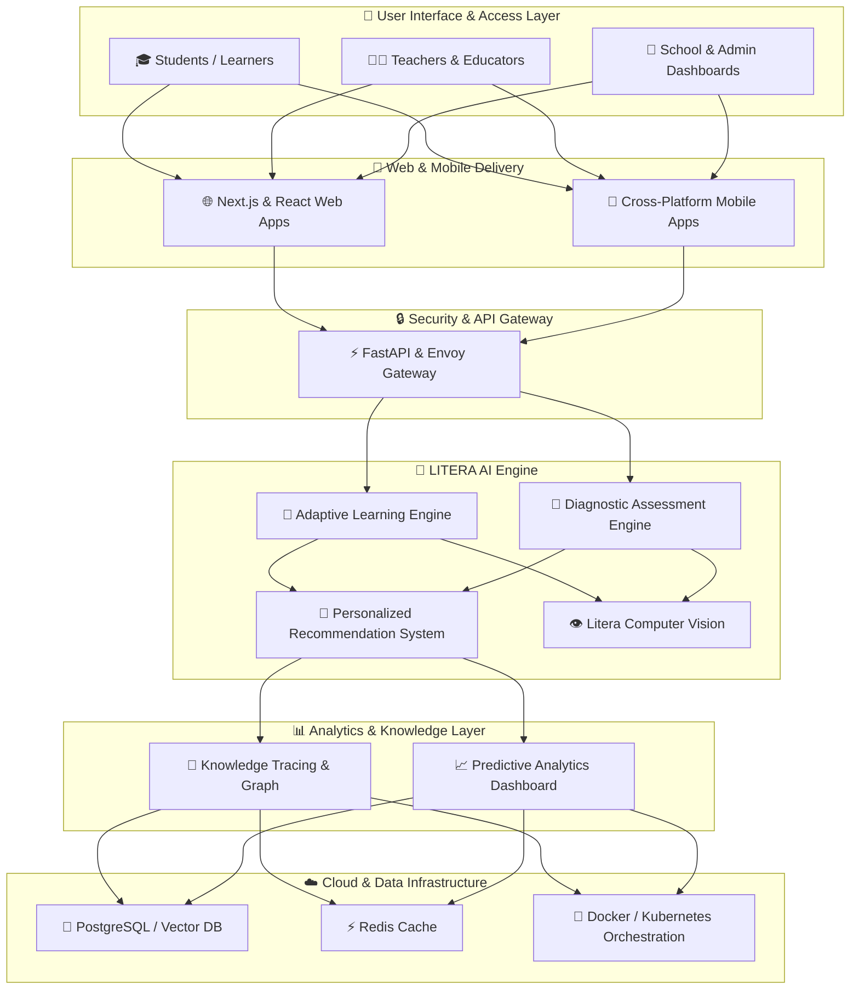
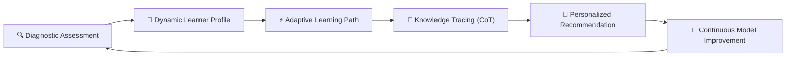
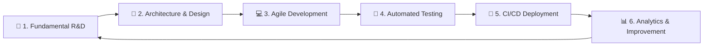

<div align="center">

  <br/>

  

  <br/>
  <br/>

  # 🌐 LITERA INTELLIGENCE
  ### *Building the Future of Education with Artificial Intelligence*

  <br/>

  [](https://git.io/typing-svg)

  <br/>

  [](https://github.com/litera-intelligence)
  [](https://github.com/litera-intelligence)
  [](https://github.com/litera-intelligence)
  [](https://github.com/litera-intelligence)

  <br/>

</div>

---

## 🏢 About Litera Intelligence

**Litera Intelligence** is an enterprise Artificial Intelligence & Educational Technology (EdTech) organization dedicated to designing, building, and deploying next-generation cognitive learning solutions. 

We engineer end-to-end intelligent systems integrating **adaptive learning**, **diagnostic assessment**, **learning analytics**, **computer vision**, and **large language models (LLMs)** to deliver deeply personalized educational experiences for every learner.

By combining cutting-edge AI research with data-driven pedagogical frameworks, Litera Intelligence empowers educators, institutions, and policymakers to make actionable, evidence-based decisions while fostering critical reasoning, literacy, and 21st-century competencies across Indonesia and the global landscape.

---

## 🎯 Vision & Mission

<div align="center">

| 👁️ **OUR VISION** | 🚀 **OUR MISSION** |
| :--- | :--- |
| **To establish a world-class, inclusive, and adaptive educational AI ecosystem that transforms how humanity learns, teaches, and innovates.** | **1. Develop high-precision AI models** tailored for personalized adaptive learning paths.<br/>**2. Equip educators and institutions** with real-time, data-driven learning analytics.<br/>**3. Expand educational accessibility** through scalable, high-performance open AI protocols (MCP). |

</div>

---

## 🚀 Core Product Suite

Litera Intelligence operates a comprehensive product matrix engineered to solve fundamental challenges in modern education:

<div align="center">

| Product | Focus & Domain | Development Status | Description |
| :--- | :--- | :---: | :--- |
| 🧠 **LITERA-AI** | Core Cognitive AI Engine | `PRODUCTION` | Frontier neural engine driving adaptive learning, CoT reasoning, and knowledge graph mapping. |
| 📝 **LITERA Assessment** | Intelligent Diagnostic Engine | `BETA` | Automated diagnostic & formative assessment system evaluating conceptual mastery and gaps. |
| 👩‍🏫 **LITERA Tutor** | Personalized Conversational AI | `ACTIVE DEV` | 24/7 AI-powered interactive tutor providing step-by-step guidance and logical reasoning support. |
| 📊 **LITERA Analytics** | Institution Learning Intelligence | `ACTIVE DEV` | Enterprise analytics dashboard delivering predictive insights and student growth tracking. |
| 👁️ **LITERA Vision** | Educational Computer Vision | `R&D` | Vision AI system analyzing engagement metrics, document scanning, and interactive learning media. |
| 🔌 **LITERA MCP** | Model Context Protocol Suite | `PRODUCTION` | Enterprise MCP infrastructure connecting LLMs securely to educational data and databases. |
| 🔮 **Future Suite** | Edge & Multimodal EdTech | `ROADMAP` | On-device lightweight AI models and immersive multimodal learning tools for offline classrooms. |

</div>

---

## 🏗️ System & Enterprise Architecture

### 1. High-Level Enterprise System Architecture



<br/>

### 2. Autonomous AI Learning Pipeline



---

## 🛠️ Technology Stack & Infrastructure

Litera Intelligence leverages an enterprise-grade, cloud-native tech stack optimized for low latency, high scalability, and robust AI inference:

<div align="center">

### **Artificial Intelligence, Deep Learning & LLMs**


### **Backend, Frontend & Mobile Systems**


### **Cloud, Databases & DevOps Infrastructure**


</div>

---

## 🔬 Research & Innovation Focus Areas

Our R&D team actively explores frontier domains at the intersection of AI and Cognitive Science:

- 🧠 **Adaptive Knowledge Tracing**: Real-time modeling of student cognitive states and knowledge decay.
- 💬 **Educational Chain-of-Thought (CoT)**: LLMs fine-tuned to explain reasoning step-by-step rather than giving raw answers.
- 👁️ **Multimodal Document Understanding**: Extracting structured diagrams, formulas, and text from printed worksheets.
- 🔌 **Standardized Educational MCP**: Building secure context protocols connecting AI models directly to LMS and SIS data.

---

## 🔄 Engineering & Development Workflow



---

## 📦 Featured Open Source Repositories

<div align="center">

| Repository | Stars | Description | Link |
| :--- | :---: | :--- | :---: |
| 🔌 **`litera-ai-mcp`** |  | Official Model Context Protocol (MCP) Server for Litera AI Engine integration. | [View Repo](https://github.com/litera-intelligence/litera-ai-mcp) |
| 🌐 **`litera-intelligence`** |  | Official Organization Landing Page & Public Profile Repository. | [View Repo](https://github.com/litera-intelligence/litera-intelligence) |

</div>

---

## 📊 Organization Analytics & Impact

<div align="center">


</div>

---

## 🏆 Milestones & Growth Roadmap

```
2026 Q1 ──► 🚀 Organization & Core MCP Server Launch (Litera-AI Architecture)
2026 Q2 ──► 📝 Beta Deployment of LITERA Diagnostic Assessment Engine
2026 Q3 ──► 🏫 Pilot Programs Across Schools & Educational Institutions in Indonesia
2026 Q4 ──► 🌐 Global Multimodal Expansion & Open Educational AI Models
```

---

## 🤝 Community & Institutional Partnerships

Litera Intelligence actively collaborates with **universities, research labs, schools, developers, and industry leaders**. 

Whether you are a researcher interested in cognitive AI models, an educator looking for intelligent tools, or a developer contributing to open-source EdTech:

- 📧 **Partnership Inquiries**: [litera.intelligence@gmail.com](mailto:litera.intelligence@gmail.com)
- 🐙 **Open Source Issues & PRs**: Welcome across all public repositories under `@litera-intelligence`.

---

<div align="center">

<br/>

### **LITERA INTELLIGENCE**
*Empowering Education with Intelligent Artificial Technology*

[](mailto:litera.intelligence@gmail.com)
[](https://github.com/litera-intelligence)
[](https://orcid.org/0009-0008-5682-0071)

<br/>

*© 2026 Litera Intelligence. All Rights Reserved. Headquartered in Indonesia.* 🇮🇩✨

</div>
