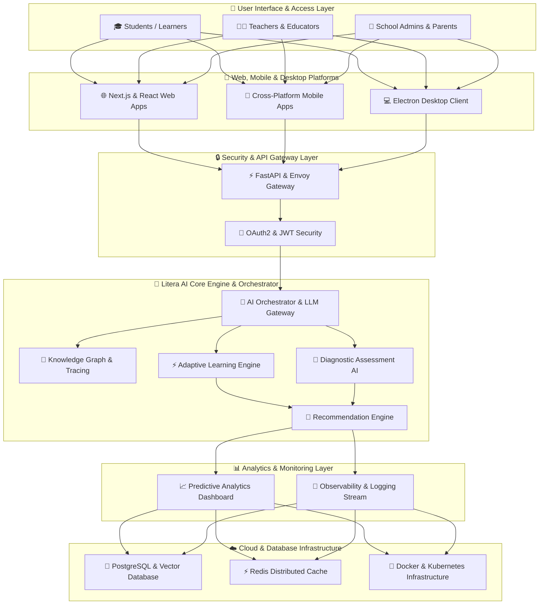
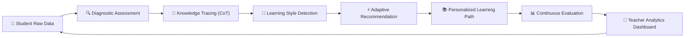
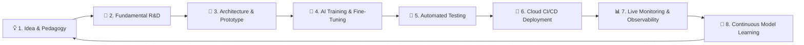

<div align="center">

  <br/>

  <!-- LOGO WITH HOLOGRAPHIC GLOW -->
  

  <br/>
  <br/>

  # 🌐 LITERA INTELLIGENCE
  ### *Building the Future of Education with Artificial Intelligence*

  <br/>

  <!-- DYNAMIC TYPING SVG HERO HEADER -->
  [](https://git.io/typing-svg)

  <br/>

  <!-- CALL TO ACTION BUTTONS -->
  <a href="https://github.com/litera-intelligence"></a>
  <a href="https://github.com/litera-intelligence/litera-ai-mcp"></a>
  <a href="https://github.com/litera-intelligence"></a>
  <a href="https://github.com/litera-intelligence"></a>
  <a href="mailto:litera.intelligence@gmail.com"></a>

  <br/>
  <br/>

</div>

---

<!-- =================================================== -->
<!-- ENTERPRISE METRICS DASHBOARD CARDS                   -->
<!-- =================================================== -->
<div align="center">

### 📊 ENTERPRISE METRICS & OPERATIONAL METRICS

| 🚀 **10+** | 🧠 **7+** | ⚡ **142 tok/s** | 🎓 **1.25M+** | 🇮🇩 **100%** |
| :---: | :---: | :---: | :---: | :---: |
| **Active Repositories** | **AI Models & MCP Core** | **Inference Speed** | **Learners Impacted** | **Indonesia Focused** |

</div>

<br/>

---

<!-- =================================================== -->
<!-- COMPANY INTRODUCTION & PHILOSOPHY                   -->
<!-- =================================================== -->
## 🏢 Company Overview & Philosophy

**Litera Intelligence** is an enterprise Artificial Intelligence & Educational Technology (AI EdTech) organization dedicated to designing, engineering, and deploying next-generation cognitive learning operating systems.

We solve fundamental inefficiencies in modern education by building high-precision AI models capable of **diagnostic assessment**, **adaptive knowledge tracing**, **step-by-step logical reasoning (CoT)**, and **real-time learning analytics**. 

Our mission is to empower learners, educators, schools, and educational institutions with personalized, data-driven learning pathways—ensuring every student reaches peak literacy, critical reasoning, and 21st-century problem-solving capabilities.

<br/>

<div align="center">

| 👁️ **Our Vision** | 🚀 **Our Mission** | 💡 **Our Innovation Strategy** |
| :--- | :--- | :--- |
| **To establish a world-class, inclusive, and adaptive educational AI ecosystem that transforms how humanity learns, teaches, and innovates.** | **1. Engineer frontier AI models** tailored for personalized adaptive learning paths.<br/>**2. Equip educators and institutions** with predictive, data-driven analytics.<br/>**3. Democratize access** to high-performance AI via open Model Context Protocols. | **• Multi-Agent Cognitive CoT Engine**<br/>**• Secure Enterprise MCP Infrastructure**<br/>**• Multimodal Computer Vision for Classrooms**<br/>**• Lightweight Edge AI Model Quantization** |

</div>

---

<!-- =================================================== -->
<!-- COMPANY TIMELINE                                    -->
<!-- =================================================== -->
## 🗓️ Company Growth Timeline

```
2026 Q1 ──► 🚀 Organization Founded & Core Litera-AI Neural Engine Architected
2026 Q2 ──► 📝 Beta Release of LITERA Diagnostic Assessment Engine & MCP Platform
2026 Q3 ──► 🏫 Pilot Implementations Across Educational Institutions & Schools in Indonesia
2026 Q4 ──► 🌐 Global Expansion of Multimodal Learning Suite & Open Educational Models
```

---

<!-- =================================================== -->
<!-- CORE PRODUCTS SUITE ROADMAP                         -->
<!-- =================================================== -->
## 🚀 Core Product Suite & Roadmap

<div align="center">

| Product | Category | Status | Tech Stack | Description |
| :--- | :--- | :---: | :--- | :--- |
| 🧠 **Litera-AI** | Cognitive Core Engine | `PRODUCTION` | `Python` `PyTorch` `CUDA` `GGUF` | Frontier AI engine driving adaptive knowledge tracing and multi-agent cognitive reasoning. |
| 👩‍🏫 **Litera Tutor** | Conversational AI Tutor | `ACTIVE DEV` | `LLM` `FastAPI` `LangChain` | 24/7 interactive tutor providing step-by-step Chain-of-Thought (CoT) problem-solving guidance. |
| 📝 **Litera Assessment** | Diagnostic Engine | `BETA` | `Scikit-Learn` `Python` `FastAPI` | Automated diagnostic & formative assessment system evaluating conceptual mastery and gaps. |
| 📊 **Litera Analytics** | Institution Intelligence | `ACTIVE DEV` | `Next.js` `React` `PostgreSQL` | Enterprise predictive analytics dashboard tracking student growth and institutional metrics. |
| 👁️ **Litera Vision** | Educational Vision AI | `R&D` | `OpenCV` `PyTorch` `Multimodal` | Vision AI system analyzing student engagement, document scanning, and handwritten media. |
| 🔌 **Litera MCP** | Context Protocol Suite | `PRODUCTION` | `Python` `FastAPI` `MCP Protocol` | Enterprise Model Context Protocol connecting AI models securely to LMS & database systems. |
| ☁️ **Litera Cloud** | AI Infrastructure | `ACTIVE DEV` | `Docker` `Kubernetes` `GCP` | Scalable cloud infrastructure optimized for low-latency AI inference and dataset hosting. |
| 🔌 **Litera API** | Developer Platform | `PRODUCTION` | `FastAPI` `REST` `gRPC` | High-speed enterprise REST & gRPC API gateway for third-party EdTech integrations. |
| 🔬 **Litera Research** | Frontier R&D Lab | `ACTIVE` | `LaTeX` `Python` `PyTorch` | Research initiatives focusing on Educational Data Mining, LLMs, and Cognitive Science. |
| 🎨 **Litera Studio** | Educator Authoring Tool | `ROADMAP` | `Next.js` `TypeScript` `Tailwind` | AI-assisted content creation platform for teachers to generate HOTS questions & lesson plans. |

</div>

---

## 💻 LIVE VS CODE IDE WORKSPACE
<div align="center">
  
</div>

---

<!-- =================================================== -->
<!-- SYSTEM & ENTERPRISE ARCHITECTURE (MERMAID 1)       -->
<!-- =================================================== -->
## 🏗️ System & Enterprise Architecture



<br/>

<!-- =================================================== -->
<!-- AI LEARNING PIPELINE (MERMAID 2)                   -->
<!-- =================================================== -->
### 🔄 Autonomous AI Learning Pipeline



---

<!-- =================================================== -->
<!-- ANIMATED LINUX AGENT TERMINAL                       -->
<!-- =================================================== -->
## 🐧 ANIMATED LINUX AGENT TERMINAL
<div align="center">
  
</div>

---

<!-- =================================================== -->
<!-- TECHNOLOGY STACK                                    -->
<!-- =================================================== -->
## 🛠️ Technology Stack & Infrastructure

<div align="center">

### **Programming Languages**


### **AI, Frameworks & Deep Learning**


### **Infrastructure, Cloud & Databases**


</div>

---

<!-- =================================================== -->
<!-- RESEARCH & INNOVATION FOCUS                         -->
<!-- =================================================== -->
## 🔬 Research & Innovation Focus Areas

Our R&D division focuses on 8 core frontiers of Artificial Intelligence in Education:

1. 🧠 **Adaptive Knowledge Tracing**: Deep Bayesian & Neural Network modeling of student mastery over time.
2. 💬 **Educational Chain-of-Thought (CoT)**: LLMs fine-tuned to explain reasoning step-by-step.
3. 👁️ **Multimodal Document & Vision AI**: Automated processing of student handwriting, diagrams, and worksheets.
4. 🔌 **Standardized Educational MCP**: Building secure protocols connecting AI directly to LMS/SIS data.
5. 📊 **Learning Analytics & Data Mining**: Predictive modeling of student retention and conceptual bottlenecks.
6. 🎯 **Personalized Recommendation Systems**: Multi-objective optimization for tailored learning trajectories.
7. 🤖 **Multi-Agent Educational Systems**: Collaborative AI agents acting as teachers, assessors, and mentors.
8. 🤝 **Human-AI Collaborative Pedagogy**: Augmenting human teachers rather than replacing them.

---

<!-- =================================================== -->
<!-- DEVELOPMENT PROCESS (MERMAID 3)                    -->
<!-- =================================================== -->
## 🔄 Engineering & R&D Development Process



---

<!-- =================================================== -->
<!-- ENTERPRISE DASHBOARD SVG PANEL                      -->
<!-- =================================================== -->
## 📊 LIVE ENTERPRISE AI ENGINE DASHBOARD
<div align="center">
  
</div>

---

<!-- =================================================== -->
<!-- GITHUB METRICS & SYNTHWAVE ANALYTICS                -->
<!-- =================================================== -->
## 📈 Organization Analytics & Impact

<div align="center">
  
  
</div>

<br />

<div align="center">
  
</div>

---

<!-- =================================================== -->
<!-- COMMUNITY & PARTNERSHIPS                            -->
<!-- =================================================== -->
## 🤝 Community & Institutional Partnerships

Litera Intelligence collaborates with **schools, universities, researchers, developers, government bodies, and industry leaders**.

- 🏫 **Schools & Institutions**: Pilot diagnostic assessment & adaptive learning platforms.
- 🎓 **Universities & Labs**: Joint AI research papers and datasets in Educational Data Mining.
- 💻 **Developers & Open-Source**: Contribute to `@litera-intelligence` open MCP servers and tooling.

---

<!-- =================================================== -->
<!-- FOOTER & TELEMETRY                                  -->
<!-- =================================================== -->
<div align="center">

  

  <br/>
  <br/>

  ### **LITERA INTELLIGENCE**
  *Building the Future of Education with Artificial Intelligence*

  <br/>

  [](mailto:litera.intelligence@gmail.com)
  [](https://github.com/litera-intelligence)
  [](https://orcid.org/0009-0008-5682-0071)

  <br/>

  *© 2026 **Litera Intelligence**. All Rights Reserved. Headquartered in Indonesia.* 🇮🇩✨

</div>
