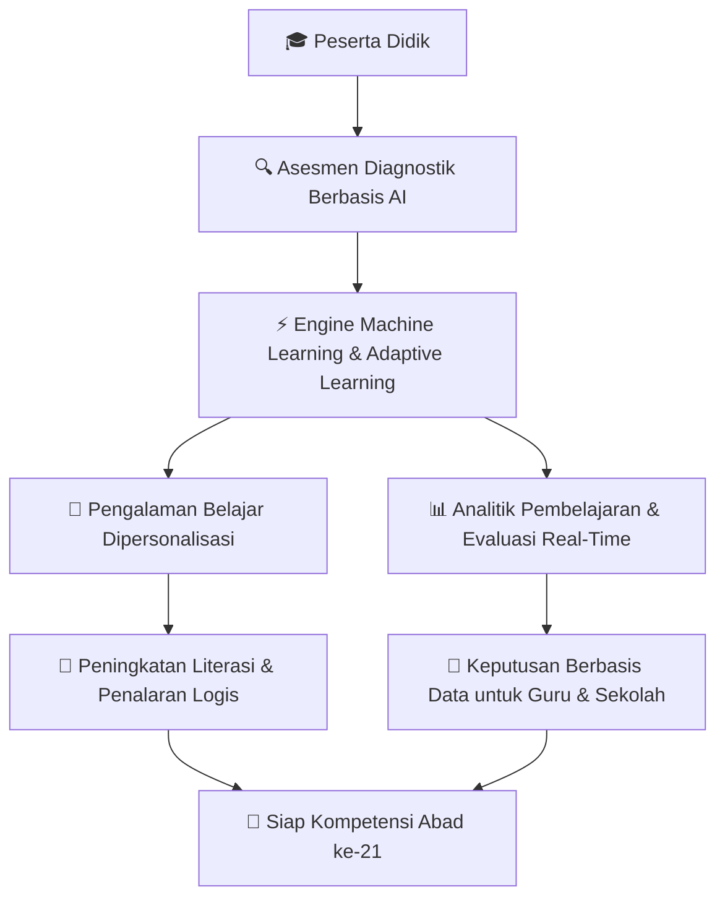

  

  # 🇮🇩 LITERA INTELLIGENCE
  ### *Pelopor Teknologi Pendidikan Adaptif Berbasis Kecerdasan Buatan di Indonesia*

  

  ---

  
  
  
  

 

> ### 🌟 **Tentang Litera Intelligence**
> **Litera Intelligence** merupakan organisasi pengembang teknologi pendidikan berbasis kecerdasan buatan (*Artificial Intelligence*) yang berfokus pada penciptaan **solusi pembelajaran adaptif** untuk meningkatkan kualitas pendidikan di Indonesia. 
>
> Kami mengembangkan platform yang memanfaatkan **asesmen diagnostik**, **machine learning**, **adaptive learning**, dan **analitik pembelajaran** untuk menghadirkan pengalaman belajar yang dipersonalisasi bagi setiap peserta didik. 
> 
> Melalui inovasi ini, kami berkomitmen membantu guru, sekolah, dan institusi pendidikan dalam mengambil keputusan berbasis data sekaligus meningkatkan kemampuan literasi, penalaran logis, dan kompetensi abad ke-21. 
> 
> Proyek utama kami, **LITERA-AI**, menjadi langkah awal dalam mewujudkan ekosistem pendidikan cerdas yang inklusif, adaptif, dan mudah diakses, dengan visi membangun masa depan pendidikan Indonesia melalui teknologi AI yang berdampak nyata.

---

## 🏛️ Alur Ekosistem Pembelajaran Adaptif (LITERA-AI)

---

## 🚀 4 Pilar Utama Solusi Kami

| Pilar | Deskripsi & Dampak |
| :--- | :--- |
| **🔍 Asesmen Diagnostik** | Memetakan potensi, kelemahan, dan gaya belajar awal siswa secara presisi menggunakan analisis cerdas. |
| **🤖 Adaptive Learning** | Menyesuaikan materi, durasi, dan tingkat kesulitan soal secara terotomatisasi (*personalized learning path*). |
| **📊 Analitik Pembelajaran** | Dashboard analitik komprehensif untuk membantu guru & sekolah mengambil **keputusan berbasis data**. |
| **🧠 Kompetensi Abad 21** | Fokus mendalam pada penguatan kemampuan **literasi**, **penalaran logis**, dan pemecahan masalah kritis. |

---

## 🛠️ Stack Teknologi & Inovasi

### **Artificial Intelligence & Data Science**

### **Platform & Infrastructure**

---

## 📈 Statistik & Performa Organisasi

---

## 🤝 Mari Berkolaborasi & Mewujudkan Masa Depan Pendidikan

Kami terbuka untuk kolaborasi dengan institusi pendidikan, sekolah, pengembang, dan peneliti AI di seluruh Indonesia.

 

*© 2026 **Litera Intelligence**. Membangun Masa Depan Pendidikan Indonesia Melalui Teknologi AI.* 🇮🇩✨

